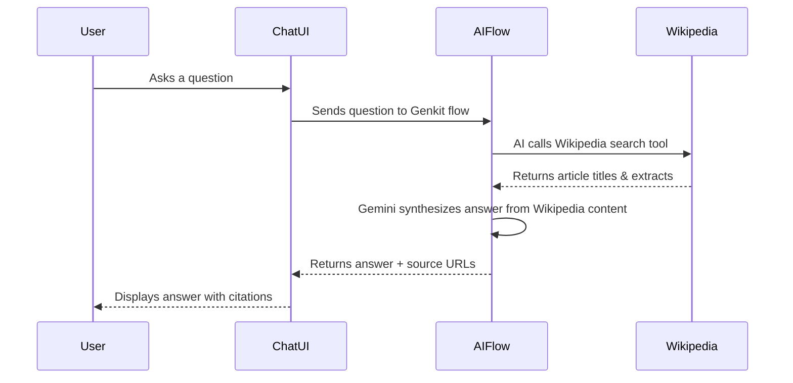

<p align="center">
  
</p>

<h1 align="center">WikiAgent</h1>
![WhatsApp Image 2026-02-28 at 11 55 18 (1)])


<p align="center">
  <strong>AI-Powered Wikipedia Question Answering Agent</strong>
</p>

<p align="center">
  
  
  
  
  
  
</p>

<p align="center">
  
  
  
</p>

<p align="center">
  🤖 An intelligent chat agent that answers your questions using Wikipedia as its knowledge source,<br/>
  powered by Google's Gemini AI with real-time Wikipedia search tool integration.
</p>

<p align="center">
  <a href="#-quick-start">Quick Start</a> •
  <a href="#-features">Features</a> •
  <a href="#-tech-stack">Tech Stack</a> •
  <a href="#-project-structure">Structure</a> •
  <a href="#-deployment">Deployment</a>
</p>

---

## 🚀 Quick Start

### Prerequisites

- **Node.js** >= 18.x
- **npm** >= 9.x
- **Google AI API Key** — Get one from [Google AI Studio](https://aistudio.google.com/apikey)

### Installation

```bash
# 1. Clone the repository
git clone https://github.com/shaikhakramshakil/loopers.git
cd loopers

# 2. Install dependencies
npm install

# 3. Set up environment variables
cp .env.example .env
# Edit .env and add your API key:
# GOOGLE_GENAI_API_KEY=your-api-key-here

# 4. Start the development server
npm run dev
```

Open [http://localhost:3000](http://localhost:3000) in your browser.

---

## ✨ Features

| Feature | Description |
|---------|-------------|
| 🧠 **AI-Powered Answers** | Uses Google Gemini 2.0 Flash to generate accurate, contextual answers |
| 📚 **Wikipedia Integration** | Real-time Wikipedia search via AI tool-calling for up-to-date information |
| 💬 **Chat Interface** | Clean, responsive chat UI with message history |
| 🔗 **Source Citations** | Every answer includes Wikipedia source URLs for verification |
| 🎨 **Modern UI** | Built with shadcn/ui components and TailwindCSS |
| 📱 **Responsive Design** | Works seamlessly on desktop and mobile devices |
| 🐳 **Docker Ready** | Multi-stage Dockerfile for production deployment |

---

## 🛠 Tech Stack

### Core

| Technology | Purpose |
|-----------|---------|
| [Next.js 15](https://nextjs.org/) | React framework with App Router |
| [TypeScript](https://www.typescriptlang.org/) | Type-safe development |
| [Genkit](https://firebase.google.com/docs/genkit) | AI framework for building AI flows |
| [Gemini 2.0 Flash](https://ai.google.dev/) | Google's latest AI model |

### Frontend

| Technology | Purpose |
|-----------|---------|
| [TailwindCSS](https://tailwindcss.com/) | Utility-first CSS framework |
| [shadcn/ui](https://ui.shadcn.com/) | Accessible, customizable UI components |
| [Radix UI](https://www.radix-ui.com/) | Headless UI primitives |
| [Lucide React](https://lucide.dev/) | Icon library |

### AI / Backend

| Technology | Purpose |
|-----------|---------|
| [Genkit AI](https://firebase.google.com/docs/genkit) | AI orchestration & tool-calling |
| [Wikipedia API](https://www.mediawiki.org/wiki/API:Main_page) | Knowledge source for answers |
| [Zod](https://zod.dev/) | Schema validation for AI I/O |

---

## 📁 Project Structure

```
wiki-agent/
├── src/
│   ├── app/                          # Next.js App Router
│   │   ├── page.tsx                  # Main WikiAgent page
│   │   ├── layout.tsx                # Root layout
│   │   └── globals.css               # Global styles & CSS variables
│   ├── ai/                           # AI Flow Logic
│   │   ├── genkit.ts                 # Genkit configuration
│   │   ├── dev.ts                    # Development server
│   │   └── flows/
│   │       └── answer-question-with-wikipedia.ts  # Core AI flow
│   ├── components/
│   │   ├── wiki-agent/               # WikiAgent-specific components
│   │   │   ├── chat-container.tsx    # Chat UI container
│   │   │   └── chat-message.tsx      # Individual message component
│   │   └── ui/                       # shadcn/ui components (31 files)
│   ├── hooks/                        # Custom React hooks
│   │   ├── use-mobile.tsx            # Mobile detection hook
│   │   └── use-toast.ts              # Toast notification hook
│   └── lib/
│       └── utils.ts                  # Utility functions
├── .env                              # Environment variables (git-ignored)
├── DockerFile                        # Multi-stage production Dockerfile
├── next.config.ts                    # Next.js configuration
├── tailwind.config.ts                # TailwindCSS configuration
├── tsconfig.json                     # TypeScript configuration
├── components.json                   # shadcn/ui configuration
├── package.json                      # Dependencies & scripts
├── CRITICAL_FIXES.md                 # Critical bug fix report
├── MEDIUM_FIXES.md                   # Medium bug fix report
├── LOW_FIXES.md                      # Low bug fix report
└── BUGS.md                           # Comprehensive bug audit
```

---

## 🧩 How It Works



---

## ⚙️ Environment Variables

| Variable | Required | Description |
|----------|----------|-------------|
| `GOOGLE_GENAI_API_KEY` | ✅ | Google AI API key from [AI Studio](https://aistudio.google.com/apikey) |

Create a `.env` file in the project root:

```env
GOOGLE_GENAI_API_KEY=your-api-key-here
```

> ⚠️ **Never commit your API key.** The `.gitignore` already excludes `.env*` files.

---

## 📦 Available Scripts

| Command | Description |
|---------|-------------|
| `npm run dev` | Start development server on `localhost:3000` |
| `npm run build` | Create optimized production build |
| `npm run start` | Start production server |
| `npm run lint` | Run ESLint for code quality checks |

---

## 🐳 Deployment

### Docker

```bash
# Build the image
docker build -t wiki-agent .

# Run the container
docker run -p 3000:3000 -e GOOGLE_GENAI_API_KEY=your-key wiki-agent
```

### Vercel

[](https://vercel.com/new)

1. Push your repository to GitHub
2. Import the project on [Vercel](https://vercel.com/)
3. Add `GOOGLE_GENAI_API_KEY` in the Environment Variables section
4. Deploy!

---

## 🐛 Bug Fix History

This project was restored from an intentionally broken state with **87+ regressions** across **30+ files**.

| Report | Severity | Files | Description |
|--------|----------|-------|-------------|
| [CRITICAL_FIXES.md](./CRITICAL_FIXES.md) | 🔴 Critical | 16 | Build-breaking config, core app, AI flow, utils |
| [MEDIUM_FIXES.md](./MEDIUM_FIXES.md) | 🟡 Medium | 30+ | Swapped, renamed, injected UI components |
| [LOW_FIXES.md](./LOW_FIXES.md) | 🟢 Low | 9 | Remaining UI components + Dockerfile |
| [BUGS.md](./BUGS.md) | 📋 Full Audit | All | Comprehensive bug identification report |

---

## 🤝 Contributing

1. Fork the repository
2. Create your feature branch (`git checkout -b feature/amazing-feature`)
3. Commit your changes (`git commit -m 'feat: add amazing feature'`)
4. Push to the branch (`git push origin feature/amazing-feature`)
5. Open a Pull Request

---

## 📄 License

This project is licensed under the MIT License — see the [LICENSE](LICENSE) file for details.

---

<p align="center">
  Built with ❤️ using <a href="https://nextjs.org">Next.js</a> and <a href="https://firebase.google.com/docs/genkit">Google Genkit</a>
</p>

